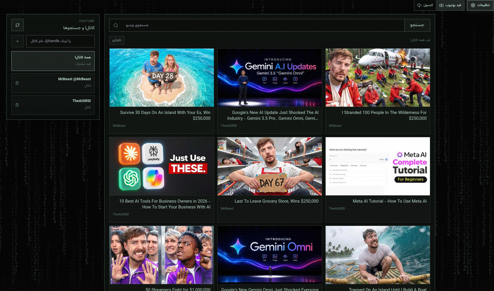

<div align="center">

# EzyTube

### A focused desktop YouTube downloader built around feeds, archives, and GitHub-powered jobs.

<p>
  
  
  
  
  
</p>

<br>



</div>

## Origin

EzyTube started as a fork of CNS by MercilessMarcel. The original project remains the upstream reference for the GitHub-backed YouTube downloader flow.

## What Is EzyTube?

EzyTube is a desktop app for finding, downloading, and managing YouTube videos without turning the workflow into a mess of tabs, terminals, and half-finished files.

Paste a link when you already know what you want, or use the built-in YouTube feed to search, follow channels, browse new videos, and send anything straight into a download job. EzyTube uses GitHub Actions as the worker, keeps completed files in your own repository, and brings the result back into a clean local archive.

The interface is Persian-first, but the idea is simple everywhere: search, send, track, archive.

## Highlights

- Desktop-first workflow with a focused Tauri shell
- Console mode for quick link downloads
- YouTube feed mode for search, channel following, and new-video tracking
- Live job cards with progress, logs, errors, and completion state
- Archive view for downloaded videos, audio, deletion, and local retrieval
- `MP4` and `MP3` output
- Quality choices for `Best`, `1080p`, `720p`, and `480p`
- Advanced video options for container, codec, and bitrate
- Automatic handling for large files through split ZIP parts
- Persian error messages and practical troubleshooting hints
- Safer local handling for GitHub tokens in the desktop app

## How It Works

EzyTube does not download heavy media directly inside the UI. Instead, it prepares a GitHub Actions job in a repository you control.

1. You choose a video, quality, and format.
2. EzyTube dispatches a workflow to GitHub Actions.
3. The worker uses `yt-dlp` to produce the final file.
4. Finished files are committed into your download archive.
5. EzyTube shows the result and lets you download or remove it.

This keeps the desktop app light while still giving you a persistent archive and visible job history.

## Setup

### 1. GitHub Token

EzyTube needs a GitHub personal access token so it can create or update the download repository and dispatch workflows.

1. Sign in to [github.com](https://github.com)
2. Open **Settings**
3. Go to **Developer settings** > **Personal access tokens** > **Tokens (classic)**
4. Create a new classic token
5. Enable `repo` and `workflow`
6. Copy the token into EzyTube settings

> [!IMPORTANT]
> Treat the GitHub token like a password. Do not paste it into screenshots, issues, chats, logs, or committed files.

### 2. YouTube Cookies

YouTube often blocks automated downloads without valid account cookies. EzyTube lets you upload a `cookies.txt` export from your own browser session.

1. Install [Get cookies.txt LOCALLY](https://chromewebstore.google.com/detail/get-cookiestxt-locally/cclelndahbckbenkjhflpdbgdldlbecc)
2. Sign in to [youtube.com](https://youtube.com)
3. Export cookies as `cookies.txt`
4. Paste the file contents into EzyTube settings
5. Save and upload the cookies

Cookies expire. If downloads start failing after working before, export fresh cookies and save them again.

### 3. Auto Setup

After the token is entered, use the auto setup button in the app. EzyTube prepares the download repository and installs the workflow it needs.

## Using EzyTube

### Console Mode

Use console mode when you already have a YouTube link.

1. Paste one video URL
2. Pick `MP4` or `MP3`
3. Pick quality for video downloads
4. Adjust advanced options when needed
5. Submit the job and follow the live status card

### Feed Mode

Use feed mode when you want to browse before downloading.

- Search YouTube videos from inside the app
- Add channels or searches as followed sources
- See new videos marked with `NEW`
- Open a video drawer for details
- Send the selected video directly to the download queue

### Archive

Completed outputs stay in the archive. From there you can download them locally, remove old files, or inspect split-file downloads.

For large outputs, EzyTube may create ZIP parts:

1. Download every part into the same folder
2. Open the `.zip` file with WinRAR or 7-Zip
3. The `.z01`, `.z02`, and later parts are joined automatically during extraction

## Development

EzyTube is built with Vite, React, TypeScript, and Tauri.

```bash
# install frontend dependencies
npm install

# start the Vite dev server
npm run dev

# type-check, build, and verify dist output
npm run build

# preview the production build
npm run preview
```

There is no dedicated test script yet. Use `npm run build` as the required validation step for changes.

## Project Layout

- `src/` contains the frontend entry points and global styles
- `src/components/` contains UI components for input, feeds, archive cards, modals, and diagnostics
- `src/lib/` contains GitHub integration, archive logic, errors, logging, i18n, and helpers
- `public/` contains static assets and local fonts
- `src-tauri/` contains the Rust/Tauri desktop shell
- `scripts/` contains small Node utilities used by package scripts
- `docs/` contains implementation notes for specific app behavior

## Security Notes

> [!CAUTION]
> GitHub tokens and YouTube cookies are sensitive credentials.
>
> - Never commit them
> - Never post them in issues or discussions
> - Hide them in screenshots
> - Revoke the GitHub token immediately if it may have leaked
> - Refresh YouTube cookies from your own trusted browser only

## Troubleshooting

### A Download Does Not Start

- Check that GitHub is reachable from your network
- Confirm the token has `repo` and `workflow` access
- Run auto setup again if the workflow is missing
- Refresh YouTube cookies if the failure mentions cookies, login, bot checks, or YouTube access

### Cookies Keep Failing

- Export cookies from the browser where you are actually signed in
- Paste the complete `cookies.txt` contents
- Avoid editing the cookie text manually
- Export a new file if the previous one is old

### GitHub Rate Limit

Wait a few minutes and retry. If the app keeps reporting rate limits, reduce repeated refreshes and avoid dispatching many jobs in a short time.

## Credits

EzyTube is built with:

- [yt-dlp](https://github.com/yt-dlp/yt-dlp)
- [Tauri](https://tauri.app)
- [React](https://react.dev)
- [Vite](https://vite.dev)
- [Tailwind CSS](https://tailwindcss.com)
- [Vazirmatn](https://github.com/rastikerdar/vazirmatn)
- [JetBrains Mono](https://www.jetbrains.com/lp/mono/)
- [Lucide](https://lucide.dev)

It also builds on the broader idea of using GitHub Actions as a personal media worker and archive pipeline.

## License

This project is released under the [MIT License](LICENSE).
